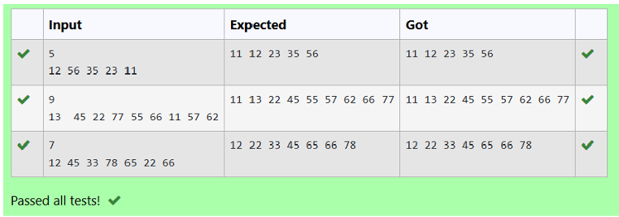

# Ex4D B+ Tree

## DATE: 16/04/2025

## AIM:

To write a C function to traverse the elements in a B+ Tree.

## Algorithm

1. Start
2. Iterate through each element in the node's data array.
3. If the node is not a leaf, recursively call traverse on the current child pointer.
4. Print the current data element.
5. After the loop, if the node is not a leaf, traverse the last child pointer.
6. Return after completing the traversal.
7. End
8. Search for the node to delete starting from the root.
9. Delete the node using standard BST rules.
10. Update the height of the affected nodes.
11. Calculate the balance factor of each updated node.
12. Perform rotations if the node is unbalanced.
13. Continue until the tree is balanced again

## Program:

```
/*
Program to traverse the elements in a B+ Tree.
Developed by: DINESHKARTHIK N
RegisterNumber: 212223220021
*/


struct B_TreeNode 
{ 
  int *data; 
  struct B_TreeNode **child_ptr; 
  int leaf; 
  int n; 
}; 
struct B_TreeNode *root = NULL, *np = NULL, *x = NULL;*/ 
 
void traverse(struct B_TreeNode *p) 
{ 
  int i; 
  for(i=0;i<p->n;i++) 
  { 
  if(p->leaf==0) 
  { 
  traverse(p->child_ptr[i]); 
  } 
  printf("%d ",p->data[i]); 
  } 
  if(p->leaf==0) 
  { 
  traverse(p->child_ptr[i]); 
  }
} 
```

## Output:



## Result:

Thus, the function to traverse the elements in a B+ Tree is implemented successfully.
