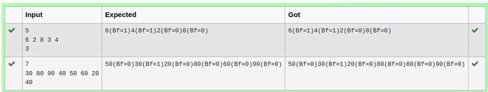

# Ex4E AVL Tree - Deletion

## DATE: 18/04/2025

## AIM:

To write a C function to delete an element from an AVL Tree.

## Algorithm

## Program:

```
/*
Program to find and display the priority of the operator in the given Postfix expression
Developed by: DINESHKARTHIK N
RegisterNumber: 212223220021
*/

node * Delete(node *T,int x)
{
  
    node *p;
    if(T==NULL)
    {
        return NULL;
    }
    else if(x>T->data)
    {
        T->right =Delete(T->right,x);
        if(BF(T)==2)
        {
            if(BF(T->left)>=0)
            {
                T=LL(T);
            }
            else
            {
                T=LR(T);
            }
        }
    }
    else
    {
        if(x<T->data)
        {
            T->left= Delete(T->left, x);
            if(BF(T)==-2)
            {
                if(BF(T->right)<=0)
                {
                    T=RR(T);
                }
                else
                {
                    T=RL(T);
                }
            }
        }
        else
        {
            if(T->right!=NULL)
            {
                p=T->right;
                while(p->left!=NULL)
                {
                    p=T->right;
                }
                T->data =p->data;
                T->right=Delete(T->right, p->data);
                {
                    if(BF(T)==2)
                    {
                        if(BF(T->left)>=0)
                        {
                            T=LL(T);
                        }
                        else
                        {
                            T=LR(T);
                        }
                    }
                }
            }
            else
            {
                return (T->left);
            }
        }
    }
    T->ht=height(T);
    return(T);
}

```

## Output:



## Result:

Thus, the C program to delete an element from an AVL Tree is implemented successfully.
